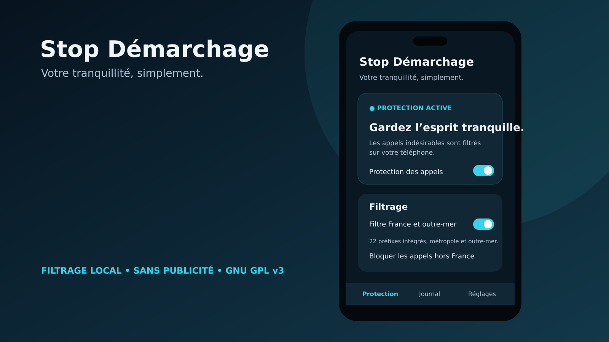

# 🛡️ Stop Démarchage

**Un filtre d’appels Android simple et léger, créé pour votre tranquillité.**

<p align="center">
  
</p>


Stop Démarchage bloque les appels indésirables tout en vous laissant utiliser votre application Téléphone habituelle. La nouvelle base **1.0** se concentre sur l’essentiel : protéger vos appels, consulter les blocages et autoriser facilement un numéro en cas d’erreur.

> **Nouvelle version : 1.0 bêta 7.** Cette présentation accompagne la refonte à venir dans le dépôt. Le code et les APK des anciennes versions peuvent encore être présents pendant la mise à jour. Vérifiez la version indiquée avant de télécharger.

## ✨ Les fonctions essentielles

| Fonction | Ce qu’elle permet |
| --- | --- |
| **Filtre France et outre-mer** | Bloquer les 22 préfixes de démarchage intégrés, activés par défaut. |
| **Appels hors France** | Refuser les numéros avec un indicatif étranger, grâce à une option désactivée par défaut. |
| **Journal des blocages** | Voir la date, le numéro et le motif des 1 000 derniers appels rejetés par l’application. |
| **Autoriser un numéro** | Créer une exception depuis le journal, prioritaire sur les règles de blocage. |
| **Règles personnelles** | Ajouter des numéros bloqués et des préfixes de votre choix. |
| **Mode strict** | Laisser passer uniquement les contacts enregistrés et les numéros autorisés, pour les appels que le service peut traiter. |
| **Communauté PhoneZen** | Utiliser une liste communautaire facultative lorsque la configuration Supabase est incluse dans la version installée. |
| **Test d’un numéro** | Vérifier les règles localement, sans passer d’appel ni remplir le journal. |
| **Pause de la protection** | Suspendre le blocage et le reprendre à tout moment. |

L’interface comporte trois écrans : **Protection**, **Journal** et **Réglages**.

Quatre thèmes sont proposés : **Clair**, **Sombre**, **Système** et **CyanogenMod**, avec son fond bleu nuit et ses accents cyan.

## 🇫🇷 Bloquer les appels hors France

Dans **Protection → Filtrage**, activez **Bloquer les appels hors France**.

Cette option bloque les numéros internationaux étrangers, par exemple ceux commençant par **+39** ou **0039**. Les indicatifs français de métropole et d’outre-mer sont exclus de cette règle :

`+33 · +262 · +508 · +590 · +594 · +596 · +681 · +687 · +689`

- Les contacts enregistrés continuent à passer directement par Android.
- Vos autorisations personnelles restent prioritaires.
- Un appel rejeté est ajouté au journal ; vous pouvez ensuite autoriser son numéro.
- Les autres règles restent applicables aux numéros français.

**Le filtre examine l’indicatif affiché, pas la position réelle de l’appelant.** Un numéro +33 utilisé depuis l’étranger n’est donc pas bloqué par cette option. Elle ne garantit pas la détection des numéros usurpés.

## 📋 Préfixes intégrés

| Zone | Préfixes |
| --- | --- |
| Métropole | 0162, 0163, 0270, 0271, 0377, 0378, 0424, 0425, 0568, 0569, 0948, 0949 |
| Guadeloupe, Saint-Martin et Saint-Barthélemy | 05987, 09475 |
| Guyane | 05988, 09476 |
| Martinique | 05989, 09477 |
| La Réunion | 02688, 09479 |
| Mayotte | 02689, 09478 |

Ces préfixes proviennent du plan de numérotation de l’Arcep, vérifié lors de la préparation de cette version. Ils sont intégrés à l’application ; leur liste n’est pas actualisée automatiquement en ligne.

**Un préfixe ne prouve pas qu’un appel est abusif.** Autorisez les numéros utiles depuis le journal si nécessaire.

## 🚀 Installation et activation

**Android 10 ou version ultérieure est nécessaire pour la refonte 1.0.**

1. Consultez les [versions publiées](https://github.com/souffly007/stopdemarchage/releases) et téléchargez l’APK de la version souhaitée, lorsqu’il est disponible.
2. Ouvrez l’APK et autorisez son installation depuis votre navigateur ou gestionnaire de fichiers si Android le demande.
3. Lancez Stop Démarchage et touchez **Activer le filtrage**.
4. Choisissez Stop Démarchage comme application **« ID de l’appelant et spam »**, **« Numéro de l’appelant et spam »** ou **« Filtrage des appels »**, selon votre téléphone.
5. Vérifiez que la protection est active et choisissez vos options.

Vous conservez votre application Téléphone pour appeler et répondre. Android n’autorise qu’une seule application de filtrage à la fois : choisir Stop Démarchage remplace le filtre précédemment sélectionné.

Pour conserver vos données lors d’une mise à jour, utilisez un APK signé avec la même clé et un code de version supérieur à celui déjà installé. Ne désinstallez pas l’application si vous souhaitez garder ses données.

## 🤝 Communauté PhoneZen

Le filtre communautaire est **facultatif et désactivé par défaut**. Il nécessite une version compilée avec la configuration Supabase adaptée.

Une fois activé, il télécharge une liste de numéros comptant **au moins 10 signalements**, avec contrôle de leur expiration. Une synchronisation quotidienne est programmée ; son exécution dépend des contraintes d’Android et du réseau.

La décision de blocage utilise le cache local : **aucune requête réseau n’est effectuée pendant le filtrage d’un appel**. Cette intégration consulte la base en lecture seule et n’envoie pas vos appels sous forme de signalements.

Sans configuration communautaire, le filtrage local reste utilisable.

## 🔒 Vie privée et légèreté

La refonte utilise les composants natifs Android, sans publicité, sans compte utilisateur et sans outil de télémétrie.

- Le journal et vos règles personnelles sont conservés sur le téléphone.
- Aucun accès au carnet d’adresses, aux SMS ou au journal d’appels système n’est demandé.
- Le filtrage local fonctionne sans connexion Internet.
- Les permissions réseau et de réception du démarrage servent à la synchronisation communautaire facultative.
- Aucun clavier téléphonique, lecteur SMS ou gestionnaire de contacts n’est inclus.

## ℹ️ Limites à connaître

- **Contacts enregistrés :** Android les laisse passer sans les transmettre à ce filtre, même s’ils correspondent à une règle de blocage.
- **Numéros masqués ou privés :** utilisez le réglage de votre application Téléphone ; ils ne sont pas transmis au service standard utilisé ici.
- **Appels WhatsApp, Signal et autres applications :** ils ne sont pas filtrés.
- **Numéros invalides, courts ou non identifiables :** ils ne sont pas bloqués par ce moteur.
- **Journal :** il contient uniquement les appels rejetés par Stop Démarchage.
- **Usurpation de numéro :** aucune protection absolue n’est promise ; les règles se basent sur le numéro présenté par Android.

## 🧪 Participer aux tests

Vous pouvez [signaler un problème](https://github.com/souffly007/stopdemarchage/issues) en indiquant :

- la version de Stop Démarchage ;
- le modèle du téléphone et la version Android ;
- l’opérateur et, en double SIM, la ligne concernée ;
- les options activées, le résultat attendu et le résultat observé.

Masquez les numéros personnels dans les captures. Le bouton **Tester un numéro**, dans les réglages, permet de vérifier les règles sans appeler de numéros inconnus.

## 🛠️ Compiler la refonte 1.0

Après publication des nouveaux fichiers dans ce dépôt :

1. Ouvrez le projet dans Android Studio.
2. Utilisez un JDK compatible avec Gradle 9.1 et Android Gradle Plugin 9.0, au minimum Java 17.
3. Installez Android SDK Platform 36 et laissez Gradle synchroniser.
4. Lancez la compilation :

```sh
chmod +x gradlew
./gradlew :app:assembleDebug
```

Sous Windows : `gradlew.bat :app:assembleDebug`.

L’APK de développement se trouve dans `app/build/outputs/apk/debug/app-debug.apk`. Les paramètres communautaires sont facultatifs ; le fichier `SUPABASE.md` fourni avec la refonte explique leur configuration. Ne publiez jamais de clé secrète Supabase ni de clé privée de signature.

## ❤️ Auteur et licence

**Créée par amour pour votre tranquillité par souffly007 (Franck R.-F.).**

Le code de la refonte 1.0 est distribué sous **GNU GPL v3 uniquement (GPL-3.0-only)**. Le texte de licence et les notices des composants tiers accompagnent ses sources. Lors de la distribution d’un APK, fournissez également l’accès au code source correspondant et à ses licences.
